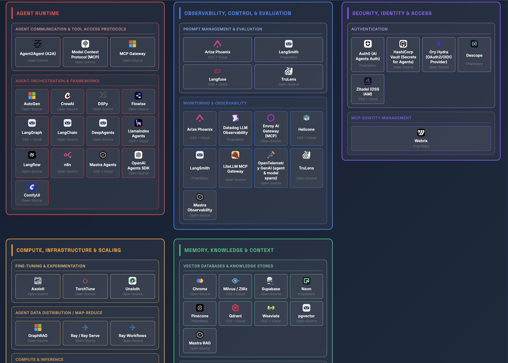

# AI Agents Infrastructure Landscape

Awesome, living curated landscape of agentic llm ops and stacks.
This repo captures the 2025 landscape of agent coding, infrastructure and LLMOps tools so you can keep up with what's real, why it exists, and how it fits together. Browse the space, see each tool's purpose, whether it's OSS or commercial, and jump straight to docs/GitHub. Use it to pick a stack, compare options, and move from research to implementation quickly.

Inspired by curated lists, but optimized for hands‑on research with your MCP Client or IDE.


## Quick Start

View the interactive landscape: [dudany.github.io/ai-infra-landscape.github.io](https://dudany.github.io/ai-infra-landscape.github.io/)

Or query this repo from your IDE/assistant via MCP-see [Connect via GitMCP](#connect-via-gitmcp) below.

Then ask your assistant questions like: "Compare LangGraph vs CrewAI for stateful agents" or "Recommend a stack for RAG with strict PII access."

[](https://dudany.github.io/ai-infra-landscape.github.io/)

*Click the image above to explore the interactive landscape or visit the [live site](https://dudany.github.io/ai-infra-landscape.github.io/)*


## Features

- **Browse via UI**: Explore layers → components → tools at [dudany.github.io/ai-infra-landscape.github.io](https://dudany.github.io/ai-infra-landscape.github.io/), open a tool to view a concise summary plus links (docs, GitHub, GitMCP where available).
- **Query via MCP**: Connect this dataset to your IDE/assistant to compare tools, filter by needs, and jump to external docs without leaving your editor.


## Connect via GitMCP

Use GitMCP to let your IDE/assistant read this repo’s docs and dataset while you research. Thanks to GitMCP, you can query this repo via MCP.

Cursor (`~/.cursor/mcp.json`):
```json
{
  "mcpServers": {
    "ai-infra-landscape.github.io Docs": {
      "url": "https://gitmcp.io/dudany/ai-infra-landscape.github.io"
    }
  }
}
```

Claude Desktop (`~/Library/Application Support/Claude/claude_desktop_config.json`):
```json
{
  "mcpServers": {
    "ai-infra-landscape.github.io Docs": {
      "command": "npx",
      "args": [
        "mcp-remote",
        "https://gitmcp.io/dudany/ai-infra-landscape.github.io"
      ]
    }
  }
}
```

After research, add implementation MCPs (example):
```json
{
  "mcpServers": {
    "langchain Docs": {
      "url": "https://gitmcp.io/langchain-ai/langchain"
    }
  }
}
```

More tips and examples in `docs/mcp.md`.

## Add tools to the landscape

Contributions welcome! Add entries to `data/tools_descriptions.json` under `tools[]`.

Example item:
```json
{
  "name": "MyTool",
  "type": "open source sdk",
  "layer": ["Agent Runtime"],
  "component": ["Agent Orchestration & Frameworks"],
  "summary": "One-liner that explains what it does and why it matters.",
  "docs_url": "https://example.com/docs",
  "github_url": "https://github.com/example/mytool",
  "icon_url": "https://example.com/favicon.ico",
  "oss": true,
  "vendor": "ExampleCo",
  "notes": "Optional extra context",
  "last_known_update": "2025-10-01"
}
```

Guidelines:
- Keep summaries short and comparison-friendly.
- Prefer official docs and GitHub links.
- Use existing `layer` and `component` values so cards render in the right place.
1. Edit the relevant file based on what you're changing:
   - Visual styles → `styles.css`
   - Theme behavior → `js/theme-manager.js`
   - Grid layout/rendering → `js/landscape.js`
   - Tool modals → `js/modal.js`

2. Test locally by opening `index.html` in a browser

3. Data is loaded from `data/tools_descriptions.json` (includes `gitmcp_url` auto‑derived from `github_url`)

